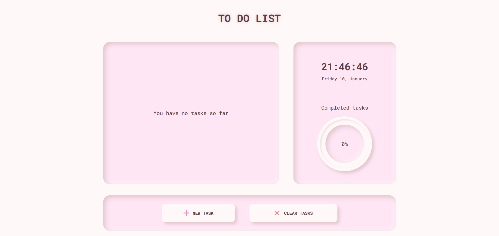
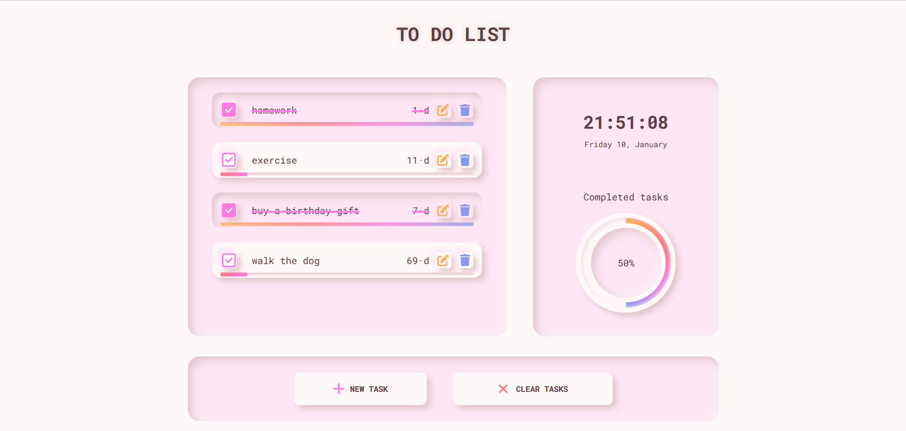
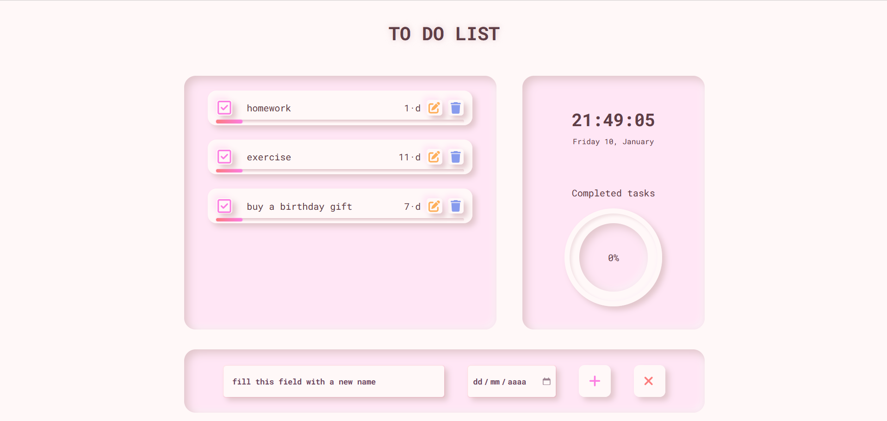
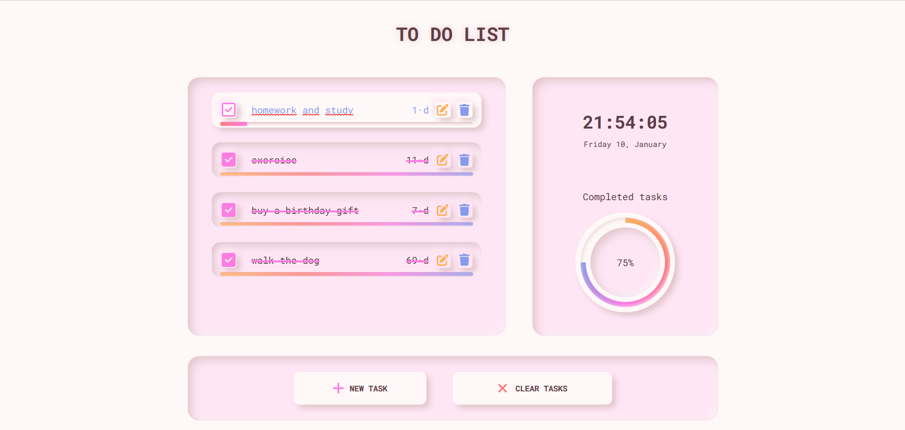

# TO DO List App

## Description

A simple, intuitive, and visually appealing To-Do List app built with HTML, CSS, and JavaScript. This app is designed for users who want an easy and efficient way to manage their tasks, all within a minimalist interface that stands out with its soft color palette. The focus is on usability and functionality, while offering a visually pleasant and engaging experience.

## Screenshots

## Features:

- **Add Tasks**: Easily add new tasks to your list with a clear and simple input field.
- **Mark Tasks as Completed**: Check off tasks once they are finished, helping you track progress.
- **Delete Tasks**: Remove tasks from the list with a single click.
- **Persistent Storage**: Tasks are saved in local storage, ensuring the consistency of the data.
- **Visual Progress Indicator**: A dynamic visual indicator shows the percentage of tasks completed, helping you track your progress in real-time.

### Key Design Elements:

- **Soft Background Colors**: Light pastel shades for the background, creating a minimalist and peaceful UI.
- **Subtle Accents**: Soft accent colors for buttons and interactive elements.
- **Subtle Textures**: The app incorporates gardients in certain elements, such as the task list and buttons, to evoke a sense of physicality and interaction.
- **Depth and Volume**: Using soft shadows and layered elements, the app creates a sense of **depth** and **volume**.
- **Elevated Interaction**: Buttons, task checkboxes, and delete icons are designed with soft gradients and shadow effects, adding a tactile "clickable" feel.

## Technologies Used:

- **HTML5**: For the structure of the app.
- **CSS3**: For the responsive styling and layout.
- **JavaScript**: To handle task functionalities like adding, deleting, and marking tasks as completed.
- **Local Storage**: To persist tasks even after the page is refreshed.

## Installation:
1. Clone the repository.
`https://github.com/jthamayo/todo-list.git`
3. Open `index.html` in your browser.

## Next Steps

Upcoming features:

- **Timer for Study or Work Sessions**: A built-in timer to help users stay focused on their tasks, whether for study or work. This feature will allow users to set specific time intervals.
  
- **New Effects for Deleting Tasks**: New visual and sound effects, such as animations or transitions, when removing tasks to add to the interactive user experience.
